# Лабораторная работа №2: 
## Тема: HTTP-методы: обработка GET, POST, PUT, DELETE

**Студент:** Геграев Ислам Русланович
**Группа:** ПИЖ-б-о-25-2
**Вариант:** 11
**Уровень:** Продвинутый
**Технологии:** Node.js + Express


## Содержание
- [Лабораторная работа №2:](#лабораторная-работа-2)
	- [Тема: HTTP-методы: обработка GET, POST, PUT, DELETE](#тема-http-методы-обработка-get-post-put-delete)
	- [Содержание](#содержание)
	- [Цель работы](#цель-работы)
	- [Теоретическое обоснование](#теоретическое-обоснование)
	- [Выполнение практического примера](#выполнение-практического-примера)
		- [Скриншоты работы всех эндпоинтов](#скриншоты-работы-всех-эндпоинтов)
	- [Выполнение индивидуального задания](#выполнение-индивидуального-задания)
		- [Скриншоты работы всех эндпоинто](#скриншоты-работы-всех-эндпоинто)
	- [Ответы на контрольные вопросы](#ответы-на-контрольные-вопросы)
	- [Вывод:](#вывод)
	- [Рекомендуемые источники](#рекомендуемые-источники)
  

## Цель работы
Освоить обработку различных HTTP-методов (GET,
POST, PUT, DELETE) в Express/Flask. Научиться реализовывать CRUDоперации над коллекцией объектов, хранящейся в памяти сервера, а также
возвращать корректные HTTP-коды ответов (200, 201, 404)

## Теоретическое обоснование
CRUD - это акроним, объединяющий четыре базовые операции над данными: Create (создание), Read (чтение), Update (обновление), Delete (удаление). Эти операции лежат в основе практически любого API, работающего с коллекцией объектов.

Каждой CRUD-операции соответствует свой HTTP-метод:

| Операция | HTTP-метод  | Что делает                                             |
| -------- | ----------- | ------------------------------------------------------ |
| Create   | POST        | Создаёт новый ресурс                                   |
| Read     | GET         | Возвращает данные, не изменяя их                       |
| Update   | PUT / PATCH | Обновляет существующий ресурс (полностью или частично) |
| Delete   | DELETE      | Удаляет ресурс                                         |


Ключевое свойство методов - **идемпотентность**: повторное выполнение одного и того же запроса не меняет результат по сравнению с первым выполнением. GET, PUT и DELETE идемпотентны, а POST - нет, так как повторный POST-запрос создаст ещё один новый ресурс. PATCH в общем случае идемпотентным не считается, так как результат зависит от того, что именно передано в теле запроса.

Отдельно стоит различать PUT и PATCH: PUT полностью заменяет ресурс (ожидается, что в теле запроса передаются все поля), тогда как PATCH обновляет только те поля, которые были явно переданы, оставляя остальные без изменений.

Сервер сообщает клиенту результат обработки запроса с помощью **кодов состояния HTTP**. В работе используются:

| Код                       | Значение                       | Когда используется                                    |
| ------------------------- | ------------------------------ | ----------------------------------------------------- |
| 200 OK                    | Успех                          | Успешный GET, PUT, PATCH                              |
| 201 Created               | Ресурс создан                  | Успешный POST                                         |
| 204 No Content            | Успех, тело ответа отсутствует | Успешный DELETE                                       |
| 400 Bad Request           | Ошибка в данных запроса        | Не хватает обязательных полей или неверный тип данных |
| 404 Not Found             | Ресурс не найден               | Обращение по несуществующему id или пути              |
| 500 Internal Server Error | Ошибка на сервере              | Необработанное исключение в коде                      |


## Выполнение практического примера
```js
const express = require('express');
const app = express();
const port = 3000;

app.use(express.json());


app.use((req, res, next) => {
	console.log(`[${new Date().toISOString()}] ${req.method} ${req.url}`);
	next();
});

let items = [
	{ id: 1, name: 'Товар 1', price: 100, quantity: 5 },
	{ id: 2, name: 'Товар 2', price: 200, quantity: 3 },
	{ id: 3, name: 'Товар 3', price: 300, quantity: 10 }
];

let nextID = 4;


app.get('/items', (req, res) => {
	res.json({
		count: items.length,
		items: items
	});
});


app.get('/items/:id', (req, res) => {
	const id = parseInt(req.params.id);
	const item = items.find(i => i.id === id);

	if (!item) {
		return res.status(404).json({
			error: 'Элемент не найден'
		});
	}
	res.json(item);
});


app.post('/items', (req, res) => {
	const { name, price, quantity } = req.body;

	if (!name || price === undefined) {
		return res.status(400).json({
			error: 'Поля name и price обязательны'
		});
	}

	const newItem = {
		id: nextID++,
		name: name,
		price: price,
		quantity: quantity || 0
	};

	items.push(newItem);
	res.status(201).json(newItem);
});


app.put('/items/:id', (req, res) => {
	const id = parseInt(req.params.id);
	const index = items.findIndex(i => i.id === id);

	if (index === -1) {
		return res.status(404).json({ error: 'Элемент не найден' });
	}

	const { name, price, quantity } = req.body;

	items[index] = {
		id: id,
		name: name || items[index].name,
		price: price !== undefined ? price : items[index].price,
		quantity: quantity !== undefined ? quantity : items[index].quantity
	};

	res.json(items[index]);
});


app.delete('/items/:id', (req, res) => {
	const id = parseInt(req.params.id);
	const index = items.findIndex(i => i.id === id);

	if (index === -1) {
		return res.status(404).json({ error: 'Элемент не найден' });
	}

	const deleteItem = items.splice(index, 1)[0];

	res.json({
		message: 'Элемент удалён',
		deleted: deleteItem
	});
});


app.listen(port, () => {
	console.log(`Сервер запущен на http://localhost:${port}`);
});

```

### Скриншоты работы всех эндпоинтов

<details>
<summary>1. <code>GET /items</code> - получение списка всех элементов.</summary>

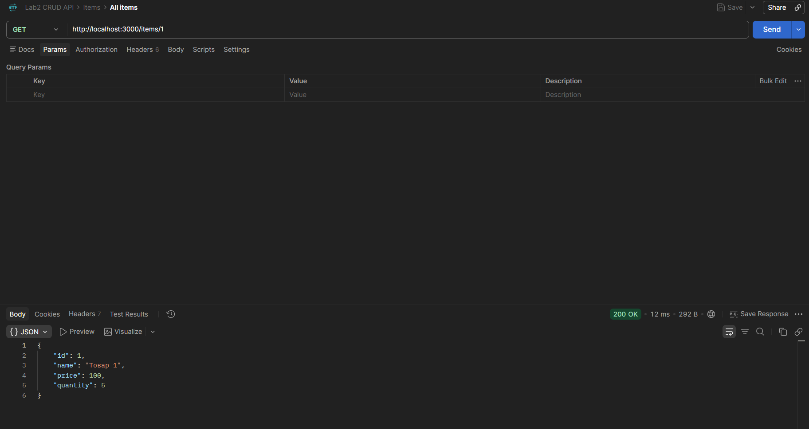

</details>

<details>
<summary>2. <code>GET /items/2</code> - получение одного существующего элемента.</summary>

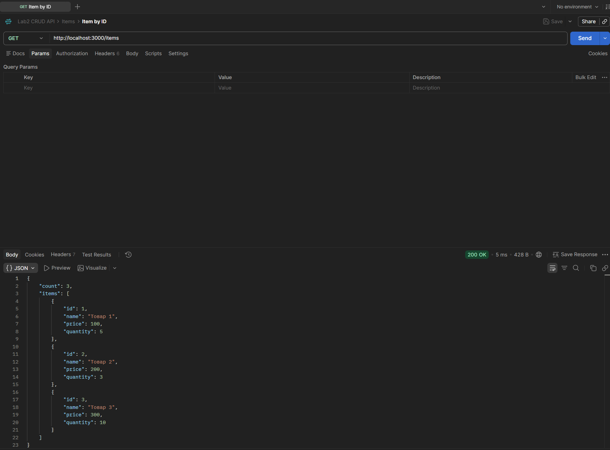

</details>

<details>
<summary>3. <code>GET /items/999</code> - запрос несуществующего элемента (проверка 404).</summary>

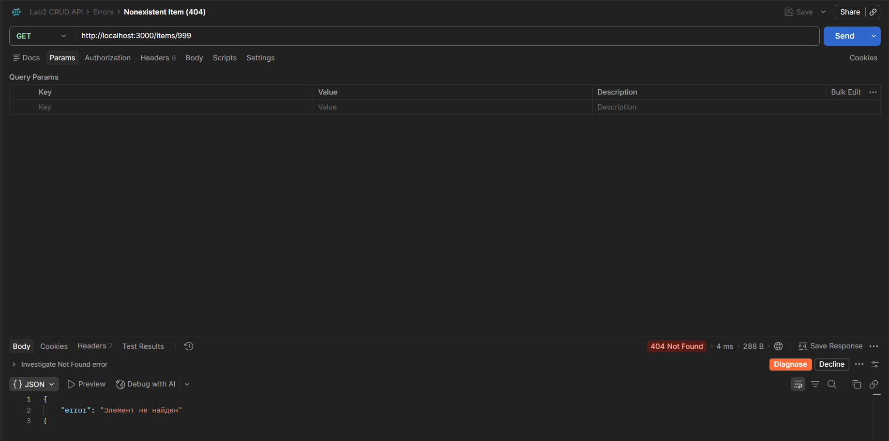

</details>

<details>
<summary>4. <code>POST /items</code> с корректным телом - создание нового элемента (проверка 201).</summary>

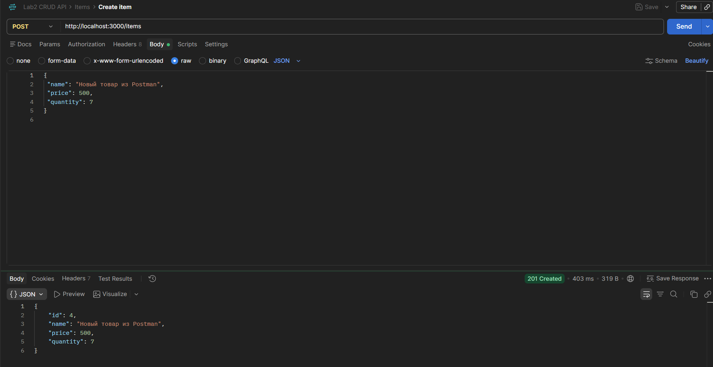

</details>

<details>
<summary>5. <code>POST /items</code> без обязательного поля <code>price</code> - проверка обработки 400.</summary>

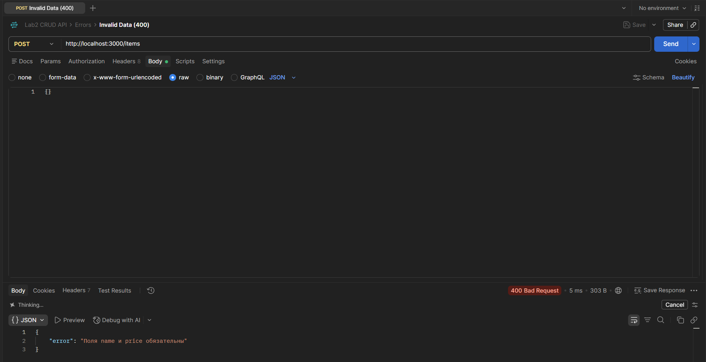

</details>

<details>
<summary>6. <code>PUT /items/1</code> - полное обновление элемента (проверка 200).</summary>

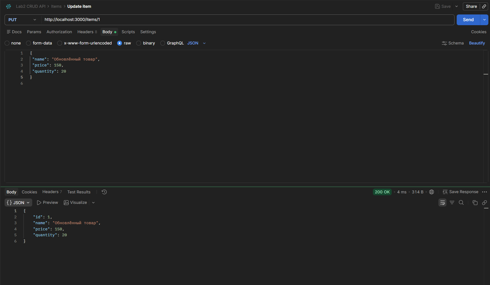

</details>

<details>
<summary>7. <code>DELETE /items/3</code> - удаление элемента (проверка 200 и тела с удалённым элементом).</summary>

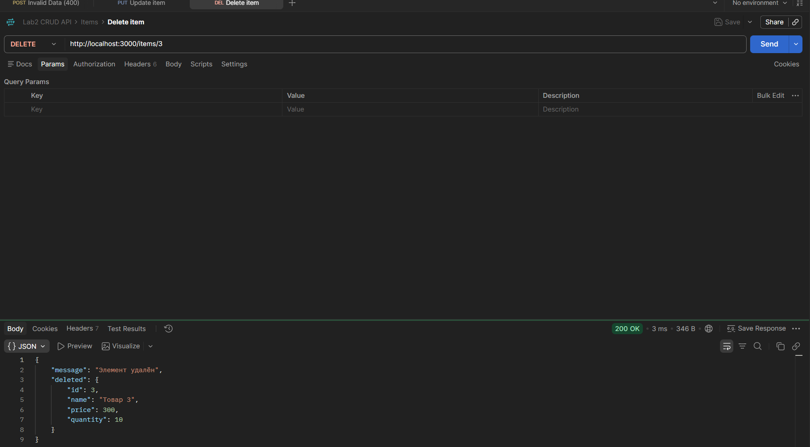

</details>


## Выполнение индивидуального задания
**Вариант 11, Продвинутый уровень.**
```js
const express = require('express');
const fs = require('fs');
const app = express();
const port = 3000;

app.use(express.json());

//& Логирование в отдельный файл
app.use((req, res, next) => {
	const log = (`[${new Date().toISOString()}] ${req.method} ${req.url}`);
	console.log(log.trim());
	fs.appendFile('access.log', log, () => { });
	next();
});

let items = [

	{ id: 1, name: 'Паста Карбонара', averageTime: '30 мин', complexity: 'Средняя' },
	{ id: 2, name: 'Борщ', averageTime: '2 часа', complexity: 'Сложная' },
	{ id: 3, name: 'Омлет с сыром', averageTime: '10 мин', complexity: 'Легкая' },
	{ id: 4, name: 'Салат Цезарь', averageTime: '40 мин', complexity: 'Средняя' },
	{ id: 5, name: 'Шарлотка', averageTime: '1 час', complexity: 'Легкая' }
];

let nextID = 6;

app.get('/items', (req, res) => {

	//~ Поиск
	let result = items;
	if (req.query.search) {
		const search = req.query.search.toLocaleLowerCase();
		result = result.filter(i => i.name.toLocaleLowerCase().includes(search));
	}

	//! Сортировка
	if (req.query.sort) {
		const order = req.query.order === 'desc' ? -1 : 1;
		result = [...result].sort((a, b) => a[req.query.sort] > b[req.query.sort] ? order : -order);
	}

	//? Палигнация
	if (req.query.page || req.query.limit) {
		const page = parseInt(req.query.page) || 1;
		const limit = parseInt(req.query.limit) || 10;
		const start = (page - 1) * limit;
		result = result.slice(start, start + limit);
	}

	res.json({
		count: items.length,
		items: items
	});
});

//& Статистика
app.get('/items/stats', (req, res) => {
	const avgTime = items.reduce((sum, i) => sum + parseInt(i.averageTime), 0) / items.length;
	res.json({ count: items.length, averageTime: avgTime.toFixed(1) });
});

app.get('/items/:id', (req, res) => {

	const id = parseInt(req.params.id);
	const item = items.find(i => i.id === id);

	if (!item) {
		return res.status(404).json({ error: 'Элемент не найден' });
	}

	res.json(item);
});

//& Связанные элементы
app.get('/items/:id/related', (req, res) => {
	const item = items.find(i => i.id === parseInt(req.params.id));
	if (!item) {
		return res.status(404).json({ error: 'Элемент не найден' });
	}

	const related = items.filter(i => i.complexity === complexity && i.id !== item.id);
	res.json(related);
});

//& Массовое создание
app.post('/items/bulk', (req, res) => {
	const newItem = req.body.map(item => ({ id: nextID++, ...item }))
	item.push(...newItem);
	res.status(201).json(newItem);
});

app.post('/items', (req, res) => {

	const { name, averageTime, complexity } = req.body;

	if (!name || !averageTime || !complexity) {
		return res.status(400).json({
			error: 'Поля name, averageTime и complexity обязательны'
		});
	}

	//& Валидация типов
	if (typeof name !== 'string' || typeof averageTime !== 'string' || typeof complexity !== 'string') {
		return res.status(400).json({ error: 'Поля должны быть строками' });
	}

	const newItem = {
		id: nextID++,
		name: name,
		averageTime: averageTime,
		complexity: complexity
	};

	items.push(newItem);
	res.status(201).json(newItem);
});

app.put('/items/:id', (req, res) => {
	const id = parseInt(req.params.id);
	const index = items.findIndex(i => i.id === id);

	if (index === -1) {
		return res.status(404).json({ error: 'Элемент не найден' });
	}
	const { name, averageTime, complexity } = req.body;

	items[index] = {
		id: id,
		name: name || items[index].name,
		averageTime: averageTime || items[index].averageTime,
		complexity: complexity || items[index].complexity,
	}

	res.json(items[index]);
});

app.patch('/items/:id', (req, res) => {

	const id = parseInt(req.params.id);
	const index = items.findIndex(i => i.id === id);

	if (index === -1) {
		return res.status(404).json({ error: 'Элемент не найден' });
	}

	items[index] = { ...items[index], ...req.body };

	res.json(items[index]);
});

//& Массивное удаление
app.delete('/items', (req, res) => {
	items = [];
	res.status(204).send();
});

app.delete('/items/:id', (req, res) => {

	const id = parseInt(req.params.id);
	const index = items.findIndex(i => i.id === id);

	if (index === -1) {
		return res.status(404).json({ error: 'Элемент не найден' });
	}

	items.splice(index, 1);
	//& 204 No Content
	res.status(204).send();

});

app.use((req, res) => {
	res.status(404).json({ error: 'Маршрут не найден' });
});
//& Глобальный обработчик ошибок
app.use((err, req, res, next) => {
	console.error(err.stack);
	res.status(500).json({ error: 'Внутренняя ошибка сервера' });
});

app.listen(port, () => {
	console.log(`Сервер запущен на http://localhost:${port}`);
});

```

### Скриншоты работы всех эндпоинто

**Базовый функционал:**

<details>
<summary>1. <code>GET /items</code> - список всех рецептов.</summary>

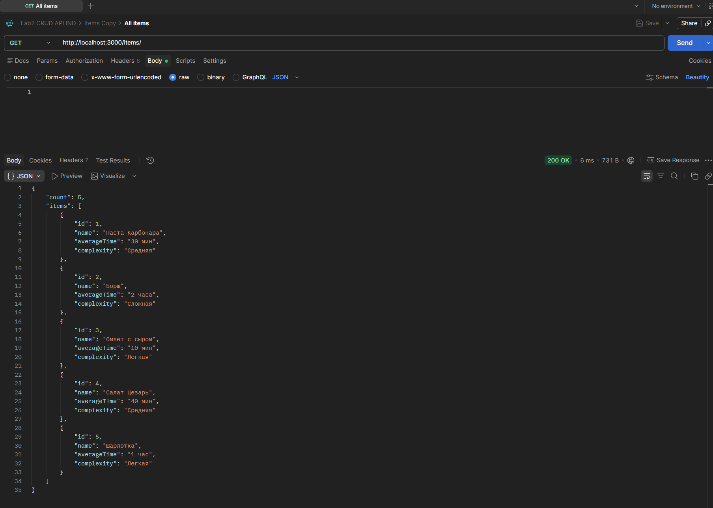

</details>

<details>
<summary>2. <code>GET /items/2</code> - один рецепт по id.</summary>

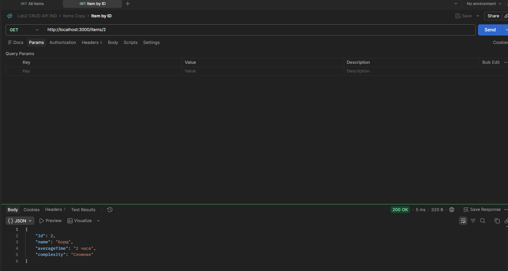

</details>

<details>
<summary>3. <code>GET /items/999</code> - 404 при отсутствии элемента.</summary>

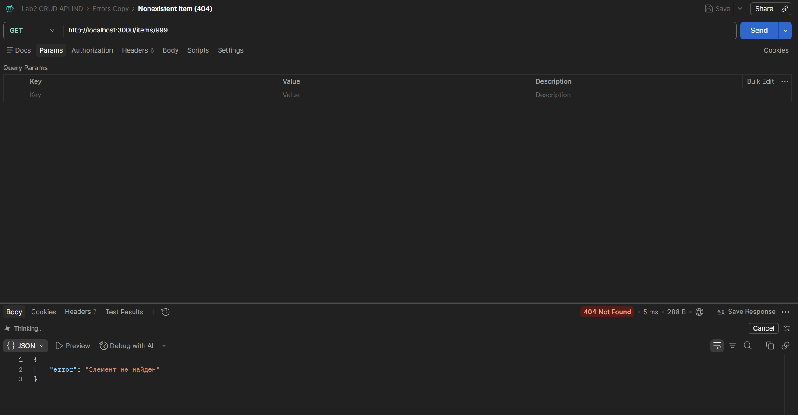

</details>

<details>
<summary>4. <code>POST /items</code> с корректным телом - создание (201).</summary>

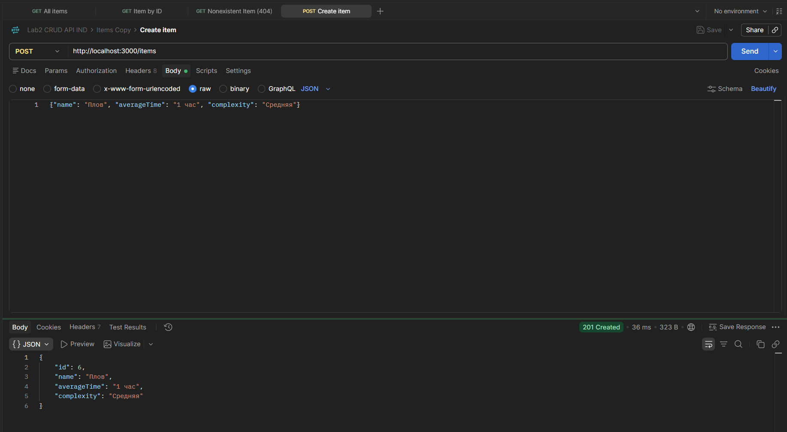

</details>

<details>
<summary>5. <code>POST /items</code> без поля <code>complexity</code> и <code>avarageTime</code> - 400 (не хватает обязательного поля).</summary>

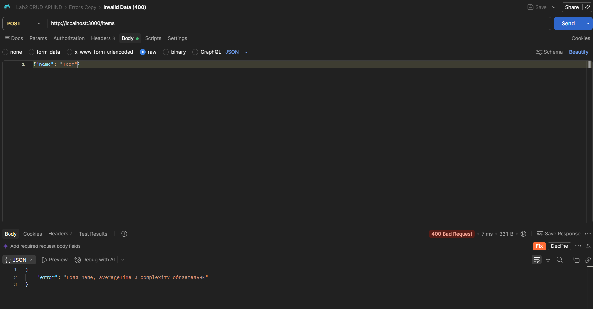

</details>

<details>
<summary>6. <code>POST /items</code> с <code>name</code> числом вместо строки - 400 (ошибка валидации типа).</summary>

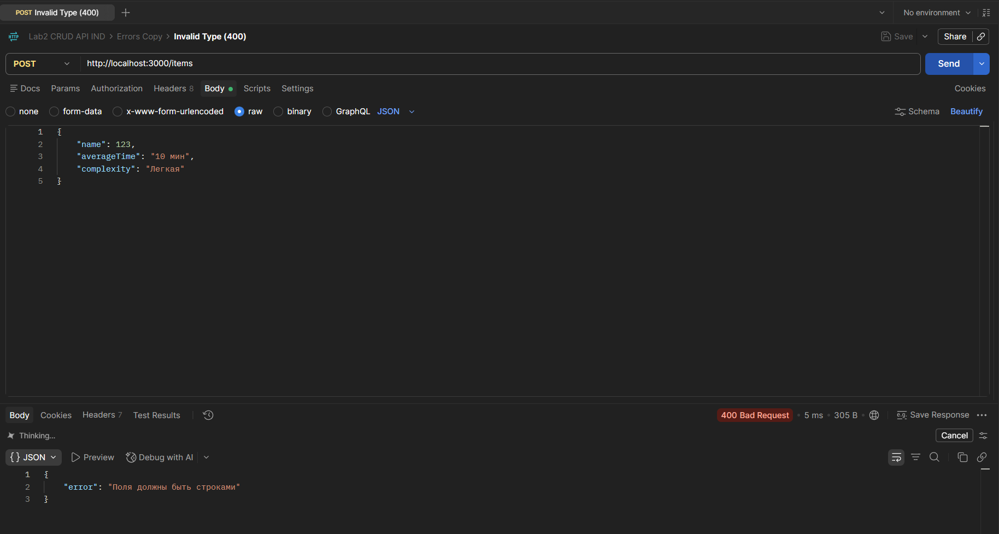

</details>

<details>
<summary>7. <code>PUT /items/1</code> - полное обновление.</summary>

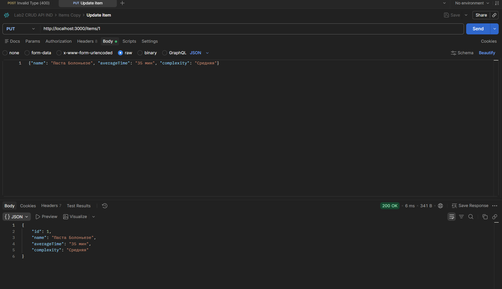

</details>

<details>
<summary>8. <code>DELETE /items/2</code> - удаление, статус 204, тело ответа пустое.</summary>

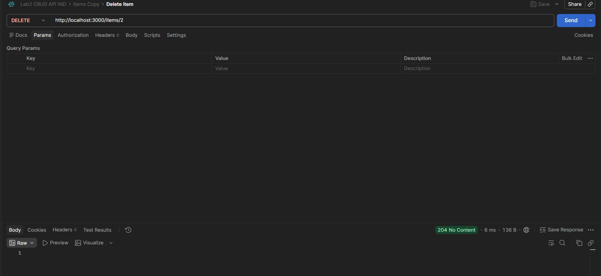

</details>

<details>
<summary>9. <code>DELETE /items/999</code> - 404 при удалении несуществующего элемента.</summary>

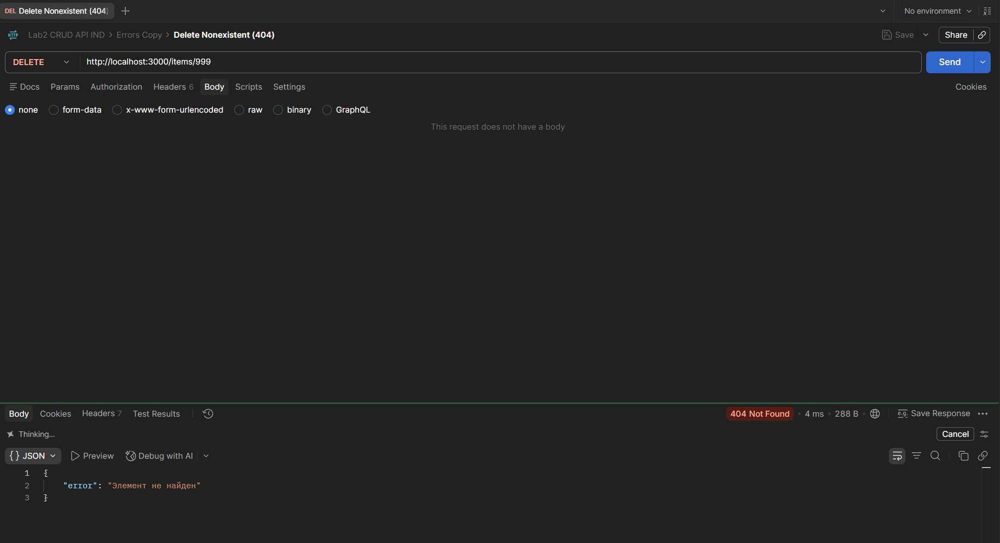

</details>

**Поиск, сортировка, пагинация:**

<details>
<summary>10. <code>GET /items?search=паста</code> - поиск по названию.</summary>

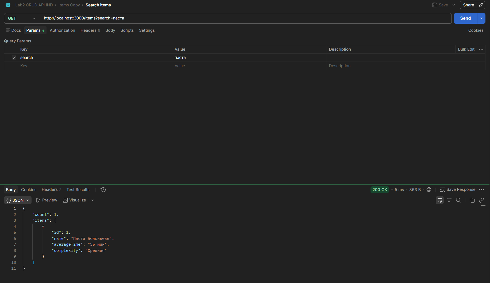

</details>

<details>
<summary>11. <code>GET /items?sort=name&order=asc</code> - сортировка по имени.</summary>

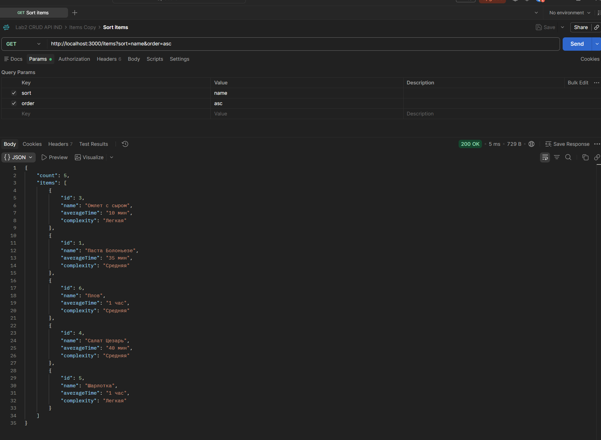

</details>

<details>
<summary>12. <code>GET /items?page=1&limit=2</code> - пагинация.</summary>

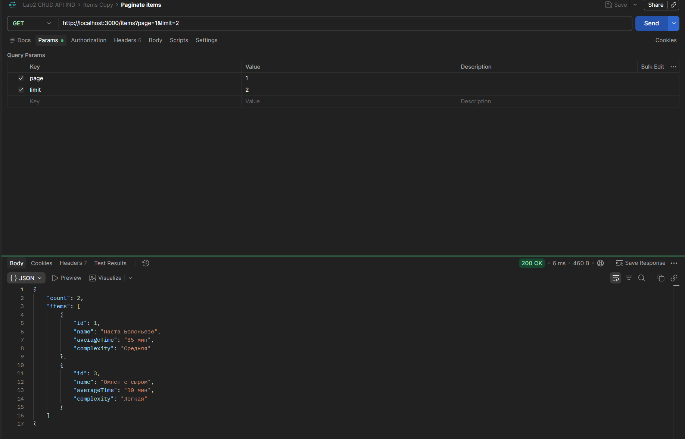

</details>

**Продвинутый уровень:**

<details>
<summary>13. <code>PATCH /items/2</code> с частичным телом (например, только <code>complexity</code>) - проверить, что остальные поля не изменились.</summary>

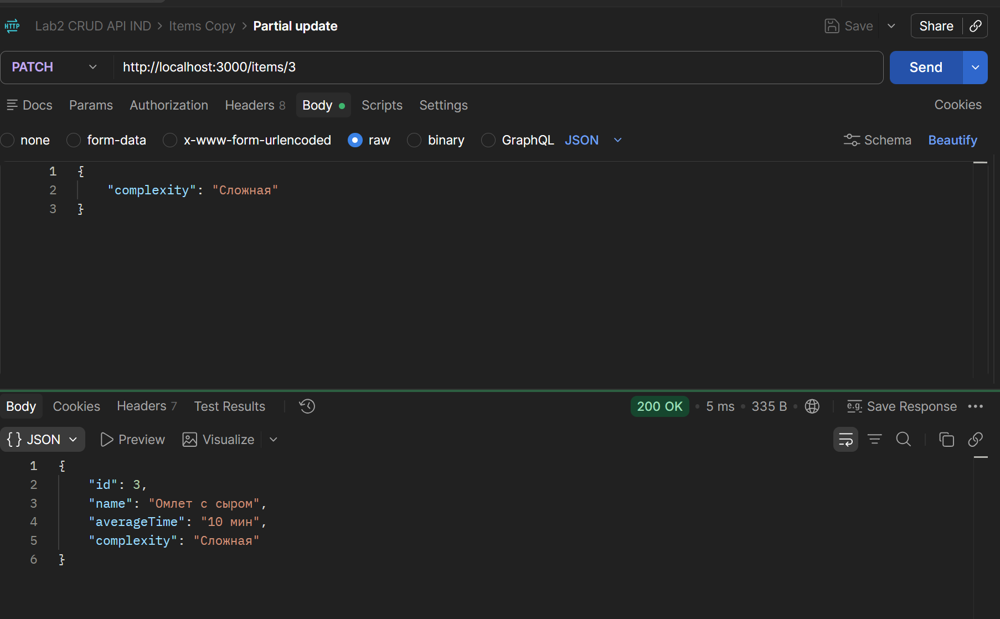

</details>

<details>
<summary>14. <code>DELETE /items</code> - массовое удаление, статус 204, после этого <code>GET /items</code> должен вернуть пустой массив.</summary>

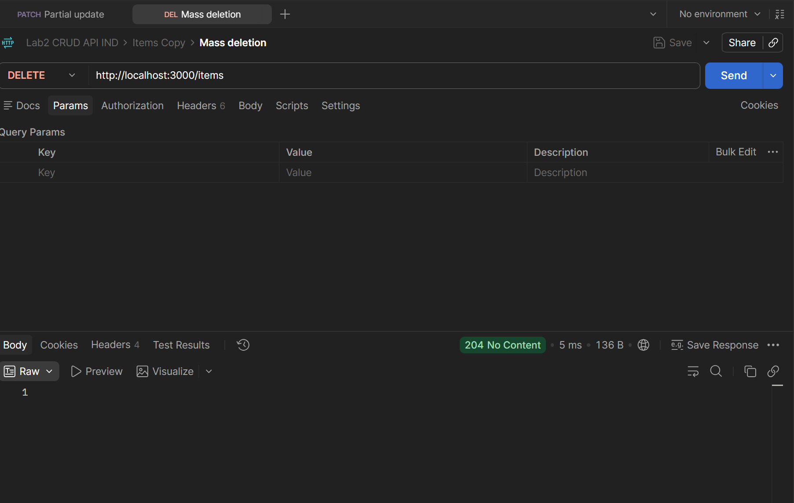

</details>

<details>
<summary>15. <code>POST /items/bulk</code> с массивом из 2-3 объектов - проверить статус 201 и присвоенные id.</summary>

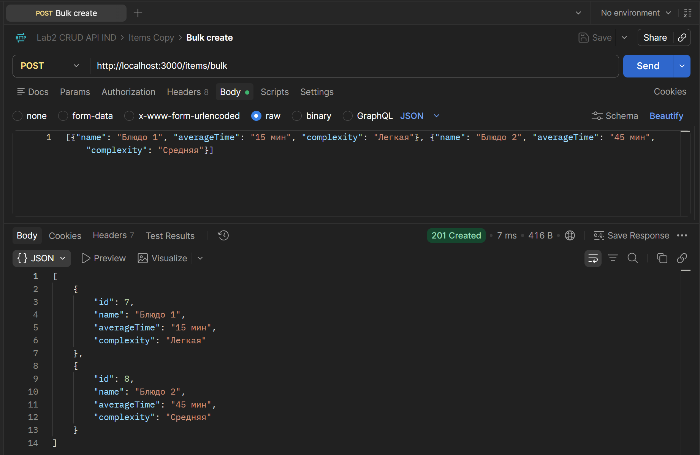

</details>

<details>
<summary>16. <code>GET /items/stats</code> - статистика (количество элементов, среднее время приготовления).</summary>

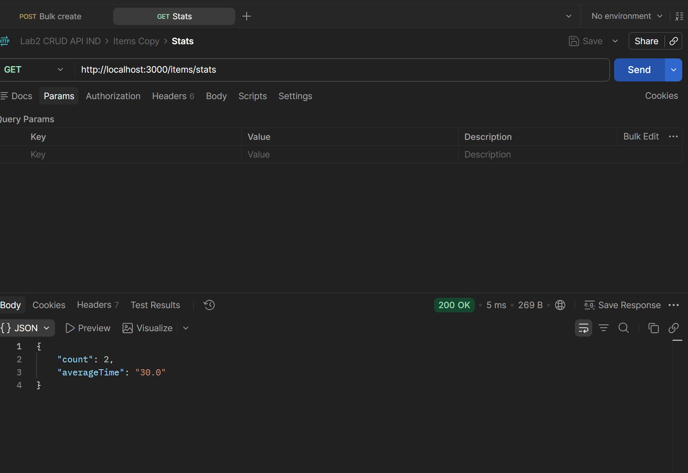

</details>

<details>
<summary>17. <code>GET /items/1/related</code> - элементы с такой же сложностью (<code>complexity</code>), что и у элемента с id=1.</summary>

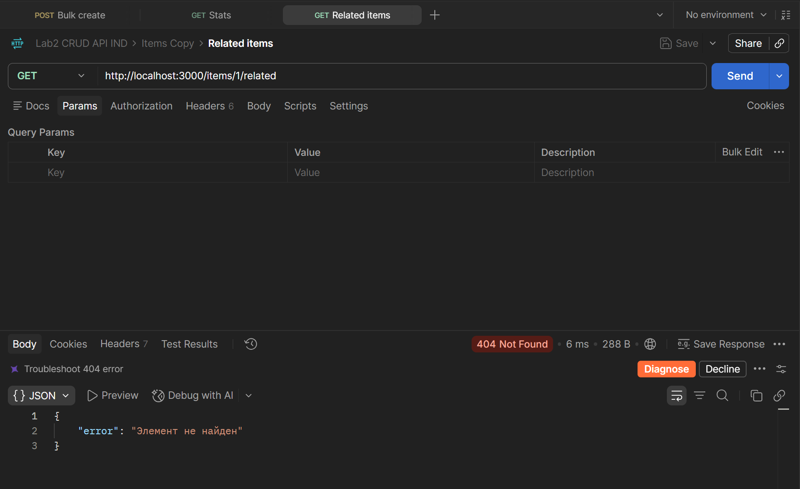

</details>

<details>
<summary>18. Скриншот файла <code>access.log</code> после нескольких запросов - подтверждение логирования в файл.</summary>

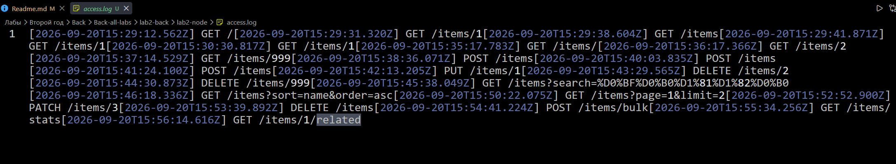

</details>


## Ответы на контрольные вопросы

**1. Как реализовать частичное обновление (PATCH)?**
Найти элемент по id, объединить старый объект с полями из req.body через spread: items[index] = { ...items[index], ...req.body }. Обновятся только переданные поля.

**2. Как реализовать массовое удаление элементов?**
Отдельный роут DELETE /items (без :id), внутри которого хранилище просто обнуляется: items = []. Вернуть 204 No Content.

**3. Как реализовать массовое создание элементов?**
Роут POST /items/bulk, принимающий массив объектов. Каждому через map присваивается новый id (nextID++), результат добавляется в хранилище через items.push(...newItems). Вернуть 201.

**4. Как реализовать глобальный обработчик ошибок?**
Middleware с четырьмя аргументами (err, req, res, next), размещённый последним в файле. Express автоматически вызывает его при любом необработанном исключении в роутах и возвращает клиенту 500 вместо падения сервера.

**5. Как логировать запросы в файл?**
В middleware для каждого запроса формируется строка с датой/методом/URL и дописывается в файл через встроенный модуль fs: fs.appendFile('access.log', log, callback).

**6. Что такое REST API и какие принципы лежат в его основе?**
Архитектурный стиль для построения API поверх HTTP. Ключевые принципы: клиент-серверная модель, отсутствие состояния на сервере (statelessness - каждый запрос самодостаточен), унифицированный интерфейс (ресурсы адресуются URL, действия - HTTP-методами), кэшируемость ответов, слоистая архитектура.

**7. Как организовать структуру проекта для масштабируемого CRUD API?**
Разделить код по слоям: routes/ (маршруты), controllers/ (логика обработки запроса), models/ (работа с данными), middleware/ (общие функции вроде логирования/валидации), app.js только собирает всё вместе. Это позволяет не хранить всю логику в одном файле.

**8. Какие существуют стратегии генерации уникальных ID?**
Автоинкремент-счётчик в памяти или в БД (простой, но не масштабируется на несколько серверов); UUID - случайная уникальная строка, не зависящая от порядка создания; ID на основе времени (например, snowflake-подобные схемы) для распределённых систем.

**9. Как защитить API от слишком больших запросов?**
Ограничить размер тела запроса через express.json({ limit: '100kb' }); использовать rate limiting (например, пакет express-rate-limit) для ограничения количества запросов от одного клиента за период времени.

**10. Как реализовать связь между сущностями (например, задачи и пользователи)?**
В объекте одной сущности хранить id связанной сущности (например, { id: 1, title: 'Задача', userId: 5 }). При необходимости получить связанные данные - искать в массиве пользователей элемент с этим id (аналогично тому, как в вашем /items/:id/related ищутся элементы с одинаковым complexity).


## Вывод: 
В ходе работы были освоены GET, POST, PUT, DELETE в Express/Flask, реализован CRUD над коллекцией в памяти и коды 200, 201, 404. Цель достигнута.

## Рекомендуемые источники

1. **Express - Routing** - https://expressjs.com/en/guide/routing.html
2. **Express - Request** и Response - https://expressjs.com/en/4x/api.html
3. **HTTP-методы(MDN)** - https://developer.mozilla.org/ru/docs/Web/HTTP/Methods
4. **Коды состояния HTTP (MDN)**- https://developer.mozilla.org/ru/docs/Web/HTTP/Status
5. **REST API Tutorial** - https://restfulapi.net/
6. **Postman Learning Center** - https://learning.postman.com/
7. **Thunder Client** - https://www.thunderclient.com/